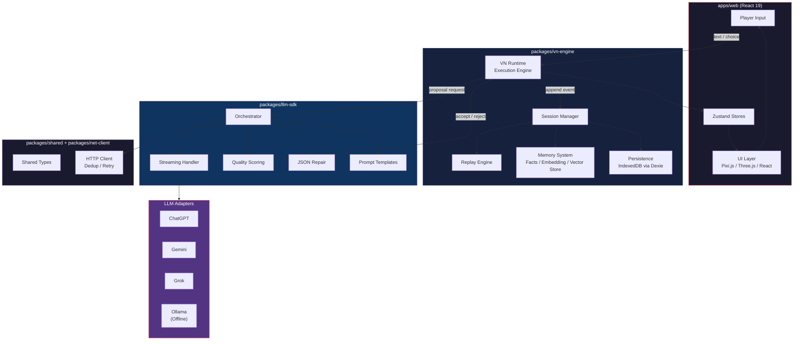

# Moyin Game

[](https://creativecommons.org/licenses/by-nc/4.0/)
[](https://github.com/AtsushiHarimoto/Moyin-Factory)
[](https://www.typescriptlang.org/)
[](https://react.dev/)
[](https://pnpm.io/)

**An AI-driven visual novel engine where every playthrough is unique.** Players interact with LLM-powered characters through branching narratives, with a deterministic append-only state model that ensures full session replay.

> **[Part of the Moyin Ecosystem](https://github.com/AtsushiHarimoto/Moyin-Factory)** -- Moyin Game is the interactive runtime within the larger Moyin creative platform.

---

## Table of Contents

- [Architecture](#architecture)
- [Monorepo Structure](#monorepo-structure)
- [Key Technical Decisions](#key-technical-decisions)
- [Tech Stack](#tech-stack)
- [Quick Start](#quick-start)
- [Scripts](#scripts)
- [Internationalization](#internationalization)
- [Testing Strategy](#testing-strategy)
- [Moyin Ecosystem](#moyin-ecosystem)
- [License](#license)
- [Japanese / Japanese](#japanese)
- [Traditional Chinese / Traditional Chinese](#traditional-chinese)

---

## Architecture



### Core Loop

```
Player Input --> VN Engine --> LLM SDK (proposal) --> Quality Judge --> Accept/Reject
                                                                          |
                                                              [Accept] Append to Session State
                                                              [Reject] Re-request from LLM
```

The LLM acts purely as a **proposal generator**. Every response is validated by the Quality Judge before being committed to the append-only session log. This separation ensures narrative consistency even across different LLM providers.

---

## Monorepo Structure

```
moyin-game/
├── apps/
│   └── web/                    @moyin/web        Game client (React 19 + Vite)
├── packages/
│   ├── llm-sdk/                @moyin/llm-sdk    Multi-provider LLM integration
│   ├── vn-engine/              @moyin/vn-engine   Visual novel engine core
│   ├── net-client/             @moyin/net-client  HTTP client with dedup & retry
│   └── shared/                 @moyin/shared      Shared types and utilities
├── pnpm-workspace.yaml
├── tsconfig.base.json
└── eslint.config.mjs
```

| Package | Responsibility |
|---------|---------------|
| **`@moyin/web`** | React 19 game client with Pixi.js/Three.js rendering, Zustand state management, React Router 7 routing, TanStack Query data fetching, Tailwind CSS 4, Framer Motion + GSAP animations, i18next (5 languages), Playwright E2E + VRT |
| **`@moyin/llm-sdk`** | Provider-agnostic LLM integration with adapters for ChatGPT, Gemini, Grok, and Ollama. Includes streaming support, malformed JSON repair, quality scoring, recording/replay, and prompt template management |
| **`@moyin/vn-engine`** | Visual novel runtime with execution engine, session management, replay engine, backlog management, memory system (facts, embeddings, vector store, summaries), and IndexedDB persistence via Dexie |
| **`@moyin/net-client`** | HTTP client layer with request deduplication, automatic retry, error handling, tracing, and i18n-aware error messages |
| **`@moyin/shared`** | Cross-package TypeScript types and utility functions |

---

## Key Technical Decisions

### 1. Append-Only Session State
All game events are immutably appended to a session log. No state is ever overwritten. This guarantees:
- **Deterministic replay** -- any session can be replayed from its event log to reproduce the exact game state
- **Debugging** -- full traceability of every state transition
- **Save/Load** -- session persistence is simply serializing the event log

### 2. LLM as Proposal Generator
The LLM never directly mutates game state. Instead:
1. The engine sends context to the LLM SDK
2. The LLM generates a **proposal** (dialogue, choices, emotional shifts)
3. The **Quality Judge** scores and validates the proposal
4. Only accepted proposals are committed as events

This architecture means swapping LLM providers (or going offline with Ollama) does not affect game integrity.

### 3. Offline-First Design
- All session data persists in **IndexedDB** (via Dexie)
- **Ollama adapter** enables fully offline play with local models
- No server dependency for core gameplay

### 4. Multi-Provider LLM Strategy
Four adapters with a unified interface:
- **ChatGPT** -- primary cloud provider
- **Gemini** -- alternative cloud provider
- **Grok** -- alternative cloud provider
- **Ollama** -- local/offline provider

Streaming, JSON repair, and quality scoring work identically across all providers.

### 5. Memory Architecture
The VN Engine maintains a layered memory system:
- **Facts** -- discrete world-state facts extracted from dialogue
- **Summaries** -- compressed narrative context for long sessions
- **Embeddings + Vector Store** -- semantic search over past events for contextual recall

---

## Tech Stack

| Layer | Technology |
|-------|-----------|
| Framework | React 19, TypeScript 5.7 |
| Build | Vite 6, pnpm 9 workspaces |
| State | Zustand 5 |
| Routing | React Router 7 |
| Data Fetching | TanStack Query 5 |
| 2D Rendering | Pixi.js 8 |
| 3D Rendering | Three.js + React Three Fiber 9, Rapier 3D physics |
| Animation | Framer Motion 11, GSAP 3 |
| Styling | Tailwind CSS 4, CVA, clsx |
| Persistence | Dexie 3 (IndexedDB) |
| i18n | i18next + react-i18next |
| Testing | Vitest (unit), Playwright (E2E + VRT) |
| Linting | ESLint 9, typescript-eslint |

---

## Quick Start

### Prerequisites

- **Node.js** >= 18.0.0
- **pnpm** >= 8.0.0 (project uses pnpm 9.15.4)

### Installation

```bash
# Clone the repository
git clone https://github.com/AtsushiHarimoto/Moyin-game.git
cd Moyin-game

# Install dependencies
pnpm install

# Start the development server
pnpm dev
```

The dev server starts at `http://localhost:8001`.

### Build for Production

```bash
pnpm build
pnpm preview
```

---

## Scripts

| Command | Description |
|---------|------------|
| `pnpm dev` | Start the web app dev server (port 8001) |
| `pnpm build` | Build the web app for production |
| `pnpm preview` | Preview the production build |
| `pnpm test` | Run all unit tests across packages |
| `pnpm test:e2e` | Run Playwright E2E tests |
| `pnpm lint` | Lint all packages |
| `pnpm typecheck` | Type-check all packages (via `tsc --noEmit`) |
| `pnpm clean` | Remove all `dist/` and `node_modules/` |

---

## Internationalization

Moyin Game supports 5 languages out of the box:

| Code | Language |
|------|----------|
| `en` | English |
| `ja` | Japanese |
| `zh-CN` | Simplified Chinese |
| `zh-HK` | Traditional Chinese (Hong Kong) |
| `zh-TW` | Traditional Chinese (Taiwan) |

Language detection is automatic via `i18next-browser-languagedetector`.

---

## Testing Strategy

- **Unit Tests** -- Vitest across all packages (`pnpm test`)
- **E2E Tests** -- Playwright for full user-flow testing (`pnpm test:e2e`)
- **Visual Regression Testing (VRT)** -- Pixel-level screenshot comparison via Playwright + pixelmatch
- **Type Safety** -- Strict TypeScript with `tsc --noEmit` checks across the monorepo

---

## Moyin Ecosystem

Moyin Game is one component of the **Moyin Ecosystem**, a suite of tools for AI-powered interactive storytelling.

| Repository | Description |
|-----------|------------|
| [**Moyin Factory**](https://github.com/AtsushiHarimoto/Moyin-Factory) | Ecosystem hub and orchestration |
| [**Moyin Game**](https://github.com/AtsushiHarimoto/Moyin-game) | AI-driven visual novel engine (this repo) |

---

## License

This work is licensed under the [Creative Commons Attribution-NonCommercial 4.0 International License](https://creativecommons.org/licenses/by-nc/4.0/).

See [LICENSE](./LICENSE) for the full text.

---

---

<a id="japanese"></a>

## Japanese

# Moyin Game

**AIが駆動するビジュアルノベルエンジン。毎回のプレイがユニーク。**

プレイヤーはLLM搭載キャラクターと分岐するナラティブを通じてインタラクションします。決定論的なAppend-Onlyステートモデルにより、完全なセッションリプレイを保証します。

> **[Moyin Ecosystemの一部](https://github.com/AtsushiHarimoto/Moyin-Factory)** -- Moyin Gameは、Moyinクリエイティブプラットフォーム内のインタラクティブランタイムです。

### アーキテクチャ概要

```
プレイヤー入力 --> VNエンジン --> LLM SDK（提案生成） --> 品質ジャッジ --> 承認/却下
                                                                       |
                                                           [承認] セッションステートに追記
                                                           [却下] LLMに再リクエスト
```

LLMは純粋に**提案ジェネレーター**として機能します。すべてのレスポンスは品質ジャッジによって検証され、承認されたもののみがAppend-Onlyセッションログにコミットされます。

### 主な技術的判断

| 判断 | 内容 |
|------|------|
| **Append-Onlyステート** | すべてのゲームイベントは不変のイベントログに追記。決定論的リプレイ、完全なトレーサビリティ |
| **LLMは提案者** | LLMはゲームステートを直接変更しない。提案→品質ジャッジ→承認の流れ |
| **オフラインファースト** | IndexedDB（Dexie経由）+ ローカルOllamaで完全オフラインプレイ対応 |
| **マルチプロバイダー** | ChatGPT、Gemini、Grok、Ollamaの4アダプター。統一インターフェース |
| **記憶アーキテクチャ** | Facts（事実）、Summaries（要約）、Embeddings + Vector Store（意味検索） |

### モノレポ構成

| パッケージ | 役割 |
|-----------|------|
| `@moyin/web` | React 19ゲームクライアント（Pixi.js / Three.js / Zustand / i18next） |
| `@moyin/llm-sdk` | マルチプロバイダーLLM統合（ストリーミング、JSON修復、品質スコアリング） |
| `@moyin/vn-engine` | VNランタイム（実行エンジン、セッション管理、リプレイ、記憶システム） |
| `@moyin/net-client` | HTTPクライアント（重複排除、リトライ） |
| `@moyin/shared` | 共有型とユーティリティ |

### クイックスタート

```bash
git clone https://github.com/AtsushiHarimoto/Moyin-game.git
cd Moyin-game
pnpm install
pnpm dev
# http://localhost:8001 でアクセス
```

### 技術スタック

React 19 / TypeScript 5.7 / Vite 6 / Zustand 5 / Pixi.js 8 / Three.js / Tailwind CSS 4 / Playwright / Vitest / pnpm 9 monorepo

### ライセンス

[CC BY-NC 4.0](https://creativecommons.org/licenses/by-nc/4.0/)

---

---

<a id="traditional-chinese"></a>

## Traditional Chinese

# Moyin Game

**AI驅動的視覺小說引擎，每次遊玩都是獨一無二的體驗。**

玩家透過分支敘事與LLM驅動的角色互動。確定性的Append-Only狀態模型確保完整的Session重播。

> **[Moyin Ecosystem的一部分](https://github.com/AtsushiHarimoto/Moyin-Factory)** -- Moyin Game是Moyin創作平台中的互動執行環境。

### 架構概覽

```
玩家輸入 --> VN引擎 --> LLM SDK（提案生成） --> 品質裁判 --> 接受/拒絕
                                                                |
                                                    [接受] 追加到Session狀態
                                                    [拒絕] 重新向LLM請求
```

LLM純粹作為**提案產生器**運作。所有回應都經過品質裁判驗證，只有被接受的提案才會提交到Append-Only Session日誌。

### 關鍵技術決策

| 決策 | 說明 |
|------|------|
| **Append-Only狀態** | 所有遊戲事件不可變地追加到事件日誌。確定性重播、完整可追溯性 |
| **LLM是提案者** | LLM不直接修改遊戲狀態。提案→品質裁判→接受的流程 |
| **離線優先** | IndexedDB（透過Dexie）+ 本地Ollama，支援完全離線遊玩 |
| **多供應商** | ChatGPT、Gemini、Grok、Ollama四個轉接器，統一介面 |
| **記憶架構** | Facts（事實）、Summaries（摘要）、Embeddings + Vector Store（語意搜尋） |

### Monorepo結構

| 套件 | 職責 |
|------|------|
| `@moyin/web` | React 19遊戲客戶端（Pixi.js / Three.js / Zustand / i18next） |
| `@moyin/llm-sdk` | 多供應商LLM整合（串流、JSON修復、品質評分） |
| `@moyin/vn-engine` | VN執行引擎（執行引擎、Session管理、重播、記憶系統） |
| `@moyin/net-client` | HTTP客戶端（重複排除、重試） |
| `@moyin/shared` | 共享型別與工具函式 |

### 快速開始

```bash
git clone https://github.com/AtsushiHarimoto/Moyin-game.git
cd Moyin-game
pnpm install
pnpm dev
# 於 http://localhost:8001 存取
```

### 技術堆疊

React 19 / TypeScript 5.7 / Vite 6 / Zustand 5 / Pixi.js 8 / Three.js / Tailwind CSS 4 / Playwright / Vitest / pnpm 9 monorepo

### 授權條款

[CC BY-NC 4.0](https://creativecommons.org/licenses/by-nc/4.0/)
