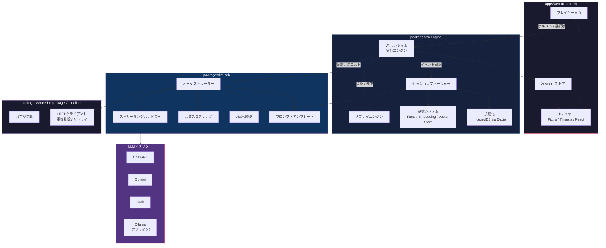

# Moyin Game

🌏 **Languages:** [English](../README.md) | [日本語](README.ja.md) | [繁體中文](README.zh-TW.md)

[](https://creativecommons.org/licenses/by-nc/4.0/)
[](https://github.com/AtsushiHarimoto/Moyin-Factory)
[](https://www.typescriptlang.org/)
[](https://react.dev/)
[](https://pnpm.io/)

**AIが駆動するビジュアルノベルエンジン。毎回のプレイがユニークな体験に。** プレイヤーはLLM搭載キャラクターと分岐するナラティブを通じてインタラクションします。決定論的なAppend-Onlyステートモデルにより、完全なセッションリプレイを保証します。

> **[Moyin Ecosystemの一部](https://github.com/AtsushiHarimoto/Moyin-Factory)** -- Moyin Gameは、Moyinクリエイティブプラットフォーム内のインタラクティブランタイムです。

---

## 目次

- [アーキテクチャ](#アーキテクチャ)
- [モノレポ構成](#モノレポ構成)
- [主な技術的判断](#主な技術的判断)
- [技術スタック](#技術スタック)
- [クイックスタート](#クイックスタート)
- [スクリプト](#スクリプト)
- [国際化](#国際化)
- [テスト戦略](#テスト戦略)
- [Moyin Ecosystem](#moyin-ecosystem)
- [ライセンス](#ライセンス)

---

## アーキテクチャ



### コアループ

```
プレイヤー入力 --> VNエンジン --> LLM SDK（提案） --> 品質ジャッジ --> 承認/却下
                                                                       |
                                                           [承認] セッションステートに追記
                                                           [却下] LLMに再リクエスト
```

LLMは純粋に**提案ジェネレーター**として機能します。すべてのレスポンスは品質ジャッジによって検証され、承認されたもののみがAppend-Onlyセッションログにコミットされます。この分離により、異なるLLMプロバイダー間でもナラティブの一貫性が保たれます。

---

## モノレポ構成

```
moyin-game/
├── apps/
│   └── web/                    @moyin/web        ゲームクライアント (React 19 + Vite)
├── packages/
│   ├── llm-sdk/                @moyin/llm-sdk    マルチプロバイダーLLM統合
│   ├── vn-engine/              @moyin/vn-engine   ビジュアルノベルエンジンコア
│   ├── net-client/             @moyin/net-client  HTTPクライアント（重複排除＆リトライ）
│   └── shared/                 @moyin/shared      共有型定義とユーティリティ
├── pnpm-workspace.yaml
├── tsconfig.base.json
└── eslint.config.mjs
```

| パッケージ | 役割 |
|---------|---------------|
| **`@moyin/web`** | React 19ゲームクライアント。Pixi.js/Three.jsレンダリング、Zustand状態管理、React Router 7ルーティング、TanStack Queryデータフェッチ、Tailwind CSS 4、Framer Motion + GSAPアニメーション、i18next（5言語対応）、Playwright E2E + VRT |
| **`@moyin/llm-sdk`** | プロバイダー非依存のLLM統合。ChatGPT、Gemini、Grok、Ollamaアダプター搭載。ストリーミング対応、不正JSON修復、品質スコアリング、録画/リプレイ、プロンプトテンプレート管理 |
| **`@moyin/vn-engine`** | ビジュアルノベルランタイム。実行エンジン、セッション管理、リプレイエンジン、バックログ管理、記憶システム（Facts、Embeddings、Vector Store、Summaries）、Dexie経由のIndexedDB永続化 |
| **`@moyin/net-client`** | HTTPクライアントレイヤー。リクエスト重複排除、自動リトライ、エラーハンドリング、トレーシング、i18n対応エラーメッセージ |
| **`@moyin/shared`** | パッケージ横断のTypeScript型定義とユーティリティ関数 |

---

## 主な技術的判断

### 1. Append-Onlyセッションステート
すべてのゲームイベントはセッションログに不変的に追記されます。ステートが上書きされることはありません。これにより以下が保証されます：
- **決定論的リプレイ** -- イベントログからセッションをリプレイし、正確なゲームステートを再現可能
- **デバッグ** -- すべての状態遷移の完全なトレーサビリティ
- **セーブ/ロード** -- セッション永続化はイベントログのシリアライズのみで完結

### 2. LLMは提案ジェネレーター
LLMはゲームステートを直接変更しません。代わりに：
1. エンジンがLLM SDKにコンテキストを送信
2. LLMが**提案**（対話、選択肢、感情変化）を生成
3. **品質ジャッジ**が提案をスコアリング・検証
4. 承認された提案のみがイベントとしてコミット

このアーキテクチャにより、LLMプロバイダーの切り替え（またはOllamaでのオフライン移行）がゲームの整合性に影響を与えません。

### 3. オフラインファースト設計
- すべてのセッションデータは**IndexedDB**（Dexie経由）に永続化
- **Ollamaアダプター**によりローカルモデルでの完全オフラインプレイが可能
- コアゲームプレイにサーバー依存なし

### 4. マルチプロバイダーLLM戦略
統一インターフェースを持つ4つのアダプター：
- **ChatGPT** -- プライマリクラウドプロバイダー
- **Gemini** -- 代替クラウドプロバイダー
- **Grok** -- 代替クラウドプロバイダー
- **Ollama** -- ローカル/オフラインプロバイダー

ストリーミング、JSON修復、品質スコアリングはすべてのプロバイダーで同一に動作します。

### 5. 記憶アーキテクチャ
VNエンジンは階層型の記憶システムを維持します：
- **Facts** -- 対話から抽出された離散的なワールドステートの事実
- **Summaries** -- 長時間セッション向けの圧縮されたナラティブコンテキスト
- **Embeddings + Vector Store** -- 文脈的想起のための過去イベントに対するセマンティック検索

---

## 技術スタック

| レイヤー | 技術 |
|-------|-----------|
| フレームワーク | React 19, TypeScript 5.7 |
| ビルド | Vite 6, pnpm 9 workspaces |
| 状態管理 | Zustand 5 |
| ルーティング | React Router 7 |
| データフェッチ | TanStack Query 5 |
| 2Dレンダリング | Pixi.js 8 |
| 3Dレンダリング | Three.js + React Three Fiber 9, Rapier 3D物理演算 |
| アニメーション | Framer Motion 11, GSAP 3 |
| スタイリング | Tailwind CSS 4, CVA, clsx |
| 永続化 | Dexie 3 (IndexedDB) |
| 国際化 | i18next + react-i18next |
| テスト | Vitest（ユニット）, Playwright（E2E + VRT） |
| リンティング | ESLint 9, typescript-eslint |

---

## クイックスタート

### 前提条件

- **Node.js** >= 18.0.0
- **pnpm** >= 8.0.0（プロジェクトではpnpm 9.15.4を使用）

### インストール

```bash
# リポジトリをクローン
git clone https://github.com/AtsushiHarimoto/Moyin-game.git
cd Moyin-game

# 依存パッケージをインストール
pnpm install

# 開発サーバーを起動
pnpm dev
```

開発サーバーは `http://localhost:8001` で起動します。

### プロダクションビルド

```bash
pnpm build
pnpm preview
```

---

## スクリプト

| コマンド | 説明 |
|---------|------------|
| `pnpm dev` | Webアプリの開発サーバーを起動（ポート8001） |
| `pnpm build` | Webアプリをプロダクション向けにビルド |
| `pnpm preview` | プロダクションビルドをプレビュー |
| `pnpm test` | 全パッケージのユニットテストを実行 |
| `pnpm test:e2e` | Playwright E2Eテストを実行 |
| `pnpm lint` | 全パッケージをリント |
| `pnpm typecheck` | 全パッケージの型チェック（`tsc --noEmit`経由） |
| `pnpm clean` | すべての `dist/` と `node_modules/` を削除 |

---

## 国際化

Moyin Gameは標準で5言語をサポートしています：

| コード | 言語 |
|------|----------|
| `en` | 英語 |
| `ja` | 日本語 |
| `zh-CN` | 簡体字中国語 |
| `zh-HK` | 繁体字中国語（香港） |
| `zh-TW` | 繁体字中国語（台湾） |

言語検出は `i18next-browser-languagedetector` により自動的に行われます。

---

## テスト戦略

- **ユニットテスト** -- 全パッケージでVitest（`pnpm test`）
- **E2Eテスト** -- Playwrightによるフルユーザーフローテスト（`pnpm test:e2e`）
- **ビジュアルリグレッションテスト（VRT）** -- Playwright + pixelmatchによるピクセルレベルのスクリーンショット比較
- **型安全性** -- モノレポ全体で `tsc --noEmit` チェックによる厳密なTypeScript

---

## Moyin Ecosystem

Moyin Gameは、AI駆動のインタラクティブストーリーテリングのためのツールスイートである**Moyin Ecosystem**の一コンポーネントです。

| リポジトリ | 説明 |
|-----------|------------|
| [**Moyin Factory**](https://github.com/AtsushiHarimoto/Moyin-Factory) | エコシステムのハブとオーケストレーション |
| [**Moyin Game**](https://github.com/AtsushiHarimoto/Moyin-game) | AI駆動ビジュアルノベルエンジン（このリポジトリ） |

---

## ライセンス

この作品は[クリエイティブ・コモンズ 表示-非営利 4.0 国際ライセンス](https://creativecommons.org/licenses/by-nc/4.0/)の下に提供されています。

全文は [LICENSE](../LICENSE) をご覧ください。
