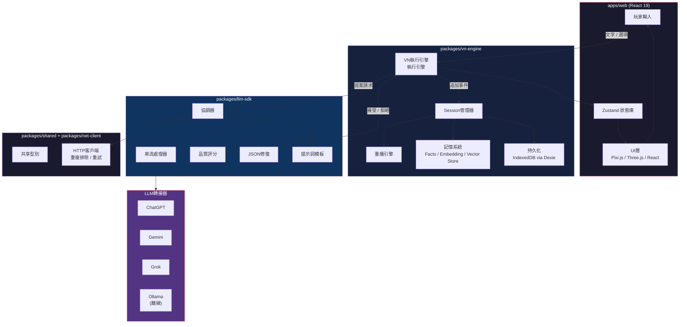

# Moyin Game

🌏 **Languages:** [English](../README.md) | [日本語](README.ja.md) | [繁體中文](README.zh-TW.md)

[](https://creativecommons.org/licenses/by-nc/4.0/)
[](https://github.com/AtsushiHarimoto/Moyin-Factory)
[](https://www.typescriptlang.org/)
[](https://react.dev/)
[](https://pnpm.io/)

**AI驅動的視覺小說引擎，每次遊玩都是獨一無二的體驗。** 玩家透過分支敘事與LLM驅動的角色互動。確定性的Append-Only狀態模型確保完整的Session重播。

> **[Moyin Ecosystem的一部分](https://github.com/AtsushiHarimoto/Moyin-Factory)** -- Moyin Game是Moyin創作平台中的互動執行環境。

---

## 目錄

- [架構](#架構)
- [Monorepo結構](#monorepo結構)
- [關鍵技術決策](#關鍵技術決策)
- [技術堆疊](#技術堆疊)
- [快速開始](#快速開始)
- [指令](#指令)
- [國際化](#國際化)
- [測試策略](#測試策略)
- [Moyin Ecosystem](#moyin-ecosystem)
- [授權條款](#授權條款)

---

## 架構



### 核心迴圈

```
玩家輸入 --> VN引擎 --> LLM SDK（提案） --> 品質裁判 --> 接受/拒絕
                                                            |
                                                [接受] 追加到Session狀態
                                                [拒絕] 重新向LLM請求
```

LLM純粹作為**提案產生器**運作。所有回應都經過品質裁判驗證，只有被接受的提案才會提交到Append-Only Session日誌。這種分離確保即使在不同的LLM供應商之間，敘事一致性也能得到保障。

---

## Monorepo結構

```
moyin-game/
├── apps/
│   └── web/                    @moyin/web        遊戲客戶端 (React 19 + Vite)
├── packages/
│   ├── llm-sdk/                @moyin/llm-sdk    多供應商LLM整合
│   ├── vn-engine/              @moyin/vn-engine   視覺小說引擎核心
│   ├── net-client/             @moyin/net-client  HTTP客戶端（重複排除＆重試）
│   └── shared/                 @moyin/shared      共享型別與工具函式
├── pnpm-workspace.yaml
├── tsconfig.base.json
└── eslint.config.mjs
```

| 套件 | 職責 |
|---------|---------------|
| **`@moyin/web`** | React 19遊戲客戶端。Pixi.js/Three.js渲染、Zustand狀態管理、React Router 7路由、TanStack Query資料獲取、Tailwind CSS 4、Framer Motion + GSAP動畫、i18next（5種語言）、Playwright E2E + VRT |
| **`@moyin/llm-sdk`** | 供應商無關的LLM整合。搭載ChatGPT、Gemini、Grok、Ollama轉接器。支援串流、異常JSON修復、品質評分、錄製/重播、提示詞模板管理 |
| **`@moyin/vn-engine`** | 視覺小說執行引擎。執行引擎、Session管理、重播引擎、對話記錄管理、記憶系統（Facts、Embeddings、Vector Store、Summaries）、透過Dexie的IndexedDB持久化 |
| **`@moyin/net-client`** | HTTP客戶端層。請求重複排除、自動重試、錯誤處理、追蹤、i18n感知錯誤訊息 |
| **`@moyin/shared`** | 跨套件的TypeScript型別定義與工具函式 |

---

## 關鍵技術決策

### 1. Append-Only Session狀態
所有遊戲事件都不可變地追加到Session日誌中。狀態永遠不會被覆寫。這保證了：
- **確定性重播** -- 任何Session都可以從其事件日誌重播，以重現精確的遊戲狀態
- **除錯** -- 每個狀態轉換的完整可追溯性
- **存檔/讀檔** -- Session持久化僅僅是序列化事件日誌

### 2. LLM作為提案產生器
LLM永遠不會直接修改遊戲狀態。取而代之的是：
1. 引擎將上下文發送到LLM SDK
2. LLM生成**提案**（對話、選項、情緒變化）
3. **品質裁判**對提案進行評分和驗證
4. 只有被接受的提案才會作為事件提交

這種架構意味著切換LLM供應商（或使用Ollama離線運行）不會影響遊戲的完整性。

### 3. 離線優先設計
- 所有Session資料都持久化在**IndexedDB**（透過Dexie）
- **Ollama轉接器**支援使用本地模型的完全離線遊玩
- 核心遊戲玩法無需伺服器依賴

### 4. 多供應商LLM策略
具有統一介面的四個轉接器：
- **ChatGPT** -- 主要雲端供應商
- **Gemini** -- 替代雲端供應商
- **Grok** -- 替代雲端供應商
- **Ollama** -- 本地/離線供應商

串流、JSON修復和品質評分在所有供應商之間以相同方式運作。

### 5. 記憶架構
VN引擎維護分層記憶系統：
- **Facts** -- 從對話中提取的離散世界狀態事實
- **Summaries** -- 用於長時間Session的壓縮敘事上下文
- **Embeddings + Vector Store** -- 對過去事件進行語意搜尋，以實現上下文回憶

---

## 技術堆疊

| 層級 | 技術 |
|-------|-----------|
| 框架 | React 19, TypeScript 5.7 |
| 建構 | Vite 6, pnpm 9 workspaces |
| 狀態管理 | Zustand 5 |
| 路由 | React Router 7 |
| 資料獲取 | TanStack Query 5 |
| 2D渲染 | Pixi.js 8 |
| 3D渲染 | Three.js + React Three Fiber 9, Rapier 3D物理引擎 |
| 動畫 | Framer Motion 11, GSAP 3 |
| 樣式 | Tailwind CSS 4, CVA, clsx |
| 持久化 | Dexie 3 (IndexedDB) |
| 國際化 | i18next + react-i18next |
| 測試 | Vitest（單元測試）, Playwright（E2E + VRT） |
| 程式碼檢查 | ESLint 9, typescript-eslint |

---

## 快速開始

### 前置需求

- **Node.js** >= 18.0.0
- **pnpm** >= 8.0.0（專案使用 pnpm 9.15.4）

### 安裝

```bash
# 複製儲存庫
git clone https://github.com/AtsushiHarimoto/Moyin-game.git
cd Moyin-game

# 安裝依賴套件
pnpm install

# 啟動開發伺服器
pnpm dev
```

開發伺服器啟動於 `http://localhost:8001`。

### 正式環境建構

```bash
pnpm build
pnpm preview
```

---

## 指令

| 指令 | 說明 |
|---------|------------|
| `pnpm dev` | 啟動Web應用開發伺服器（連接埠8001） |
| `pnpm build` | 為正式環境建構Web應用 |
| `pnpm preview` | 預覽正式環境建構 |
| `pnpm test` | 執行所有套件的單元測試 |
| `pnpm test:e2e` | 執行Playwright E2E測試 |
| `pnpm lint` | 檢查所有套件的程式碼 |
| `pnpm typecheck` | 對所有套件進行型別檢查（透過 `tsc --noEmit`） |
| `pnpm clean` | 移除所有 `dist/` 和 `node_modules/` |

---

## 國際化

Moyin Game 開箱即支援5種語言：

| 代碼 | 語言 |
|------|----------|
| `en` | 英語 |
| `ja` | 日語 |
| `zh-CN` | 簡體中文 |
| `zh-HK` | 繁體中文（香港） |
| `zh-TW` | 繁體中文（台灣） |

語言偵測透過 `i18next-browser-languagedetector` 自動進行。

---

## 測試策略

- **單元測試** -- 全套件使用Vitest（`pnpm test`）
- **E2E測試** -- Playwright進行完整使用者流程測試（`pnpm test:e2e`）
- **視覺迴歸測試（VRT）** -- 透過Playwright + pixelmatch進行像素級截圖比較
- **型別安全** -- 在整個monorepo中使用 `tsc --noEmit` 檢查的嚴格TypeScript

---

## Moyin Ecosystem

Moyin Game是**Moyin Ecosystem**的一個組件，這是一套用於AI驅動互動敘事的工具套件。

| 儲存庫 | 說明 |
|-----------|------------|
| [**Moyin Factory**](https://github.com/AtsushiHarimoto/Moyin-Factory) | 生態系統中樞與協調 |
| [**Moyin Game**](https://github.com/AtsushiHarimoto/Moyin-game) | AI驅動視覺小說引擎（本儲存庫） |

---

## 授權條款

本作品以[創用CC 姓名標示-非商業性 4.0 國際授權條款](https://creativecommons.org/licenses/by-nc/4.0/)授權。

完整條文請見 [LICENSE](../LICENSE)。
